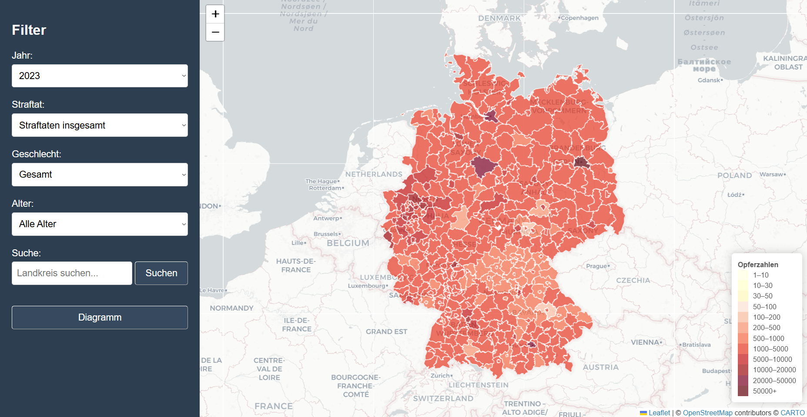
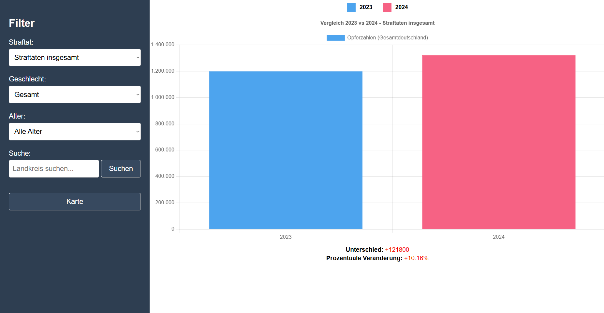

# Dashboard PKS

Dieses Projekt ist im Rahmen der WebTechnologien Vorlesung entstanden. Es zeigt die Opferstatistik aus den Daten der Polizeilichen Kriminalstatistik für die Jahre 2023 und 2024 auf einer Karte im regionalen Vergleich. Man kann auch auf eine Diagramm Ansicht wechseln, wo man die beiden Jahre direkt vergleichen kann.

## Tech Stack

- PHP
- JavaScript
- CSS
- HTML

## Features

- Datenbank anlegen und abfragen
- Such- und Filterfunktionen
- Daten anzeigen auf einer Karte / als Balkendiagramm

## Screenshots




## Installation

- Projekt in xampp\htdocs speichern
- index.php in index\_.php umbenennen

### DB aufsetzen

- in xampp Apache und mySQL starten und zu phpmyAdmin navigieren
- in phpmyAdmin die DB "straftaten_opfer" anlegen
- mit dem folgenden Befehl die Tabelle erstellen:

```sql
CREATE TABLE `pks_daten` (
  `id` INT AUTO_INCREMENT PRIMARY KEY,
  `jahr` INT(4),
  `straftat` VARCHAR(255),
  `ags` VARCHAR(5),
  `ort` VARCHAR(255),
  `opfer_insgesamt` INT,
  `opfer_m` INT,
  `opfer_w` INT,
  `kinder_u6_insg` INT,
  `kinder_u6_m` INT,
  `kinder_u6_w` INT,
  `kinder_6_14_insg` INT,
  `kinder_6_14_m` INT,
  `kinder_6_14_w` INT,
  `kinder_u14_insg` INT,
  `kinder_u14_m` INT,
  `kinder_u14_w` INT,
  `jugendliche_14_18_insg` INT,
  `jugendliche_14_18_m` INT,
  `jugendliche_14_18_w` INT,
  `heranwachsende_18_21_insg` INT,
  `heranwachsende_18_21_m` INT,
  `heranwachsende_18_21_w` INT,
  `erwachsene_21_60_insg` INT,
  `erwachsene_21_60_m` INT,
  `erwachsene_21_60_w` INT,
  `erwachsene_60_plus_insg` INT,
  `erwachsene_60_plus_m` INT,
  `erwachsene_60_plus_w` INT,
  `erwachsene_insg` INT,
  `erwachsene_m` INT,
  `erwachsene_w` INT,
  INDEX (`ags`),
  INDEX (`straftat`),
  INDEX (`jahr`)
) ENGINE=InnoDB DEFAULT CHARSET=utf8mb4;
```

- dann xampp\htdocs\projekt\index.php in index\_.php umbenennen, um auf import.php (in db) zugreifen zu können
- import23.php und import24.php im localhost ausführen (es sollten je 2400 Zeilen importiert werden)
- index\_.php wieder in index.php umbenennen

## Learnings

- Daten sind nicht immer korrekt, hier mussten die CSV Dateien manuell überprüft werden
- Umgang mit Maps
- Kommunikation mit Datenbank nach AJAX-Prinzip
